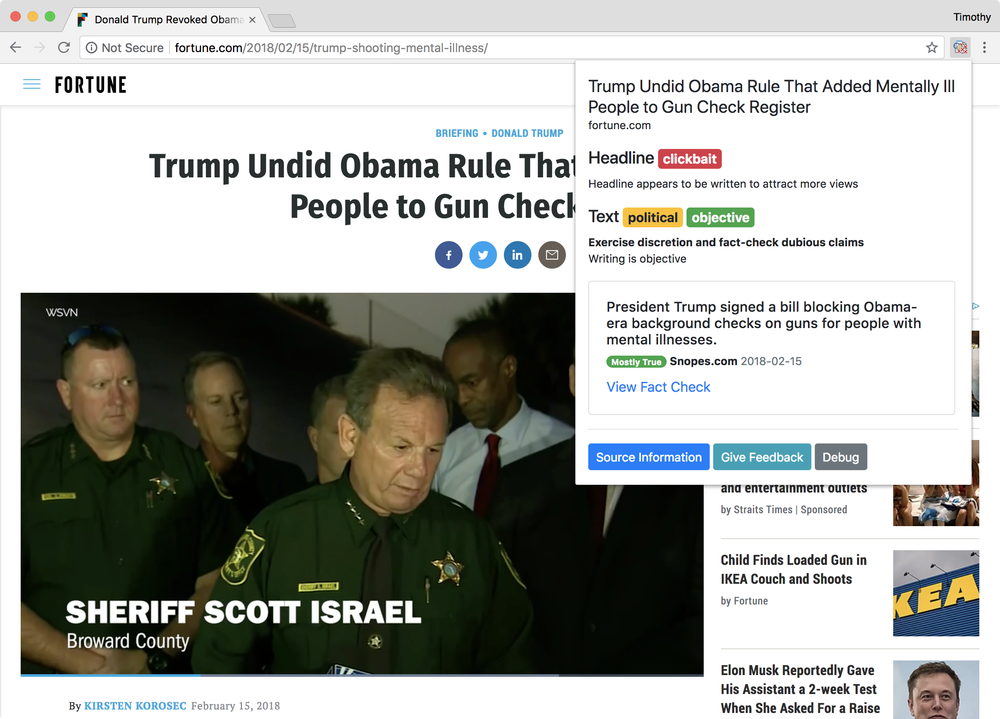
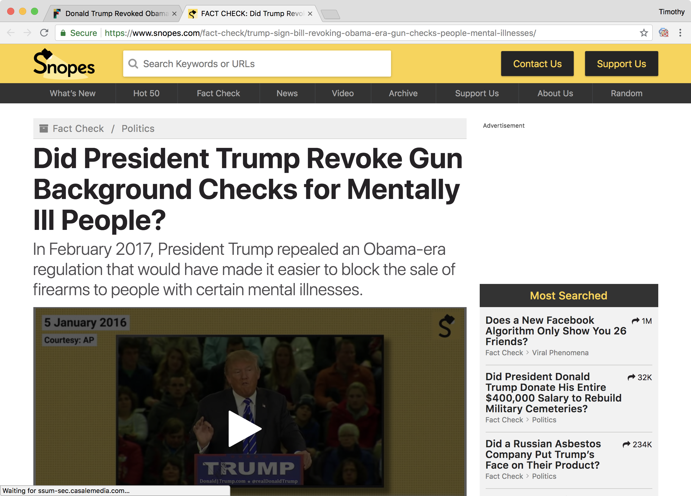
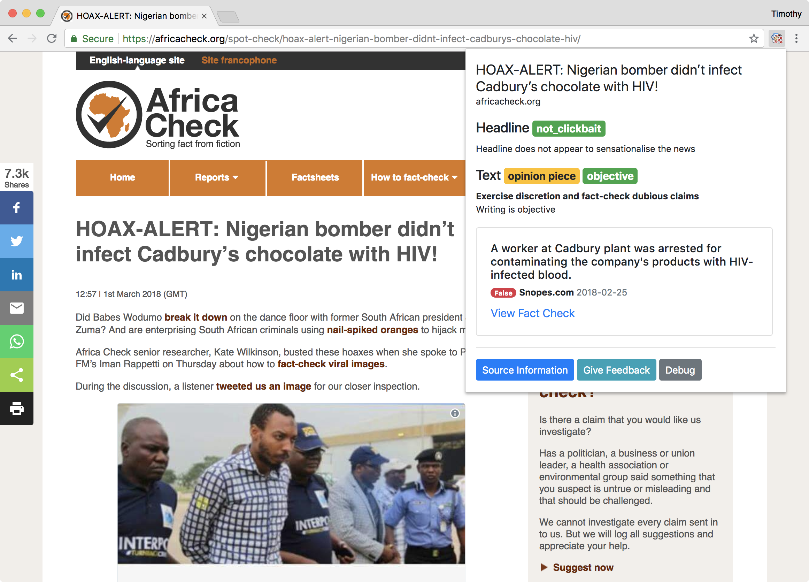
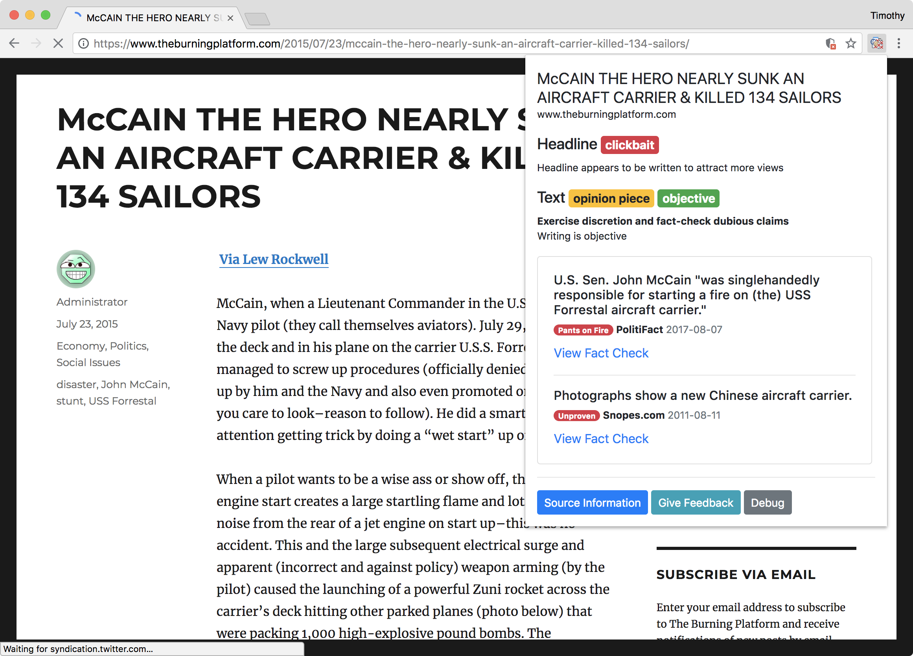
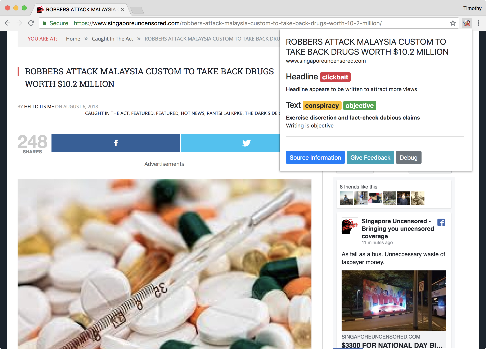
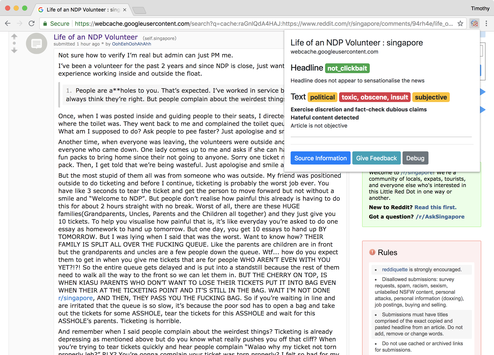
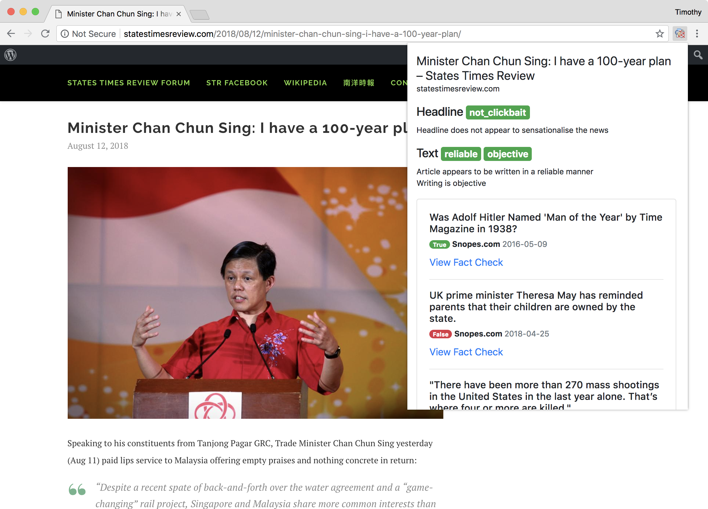
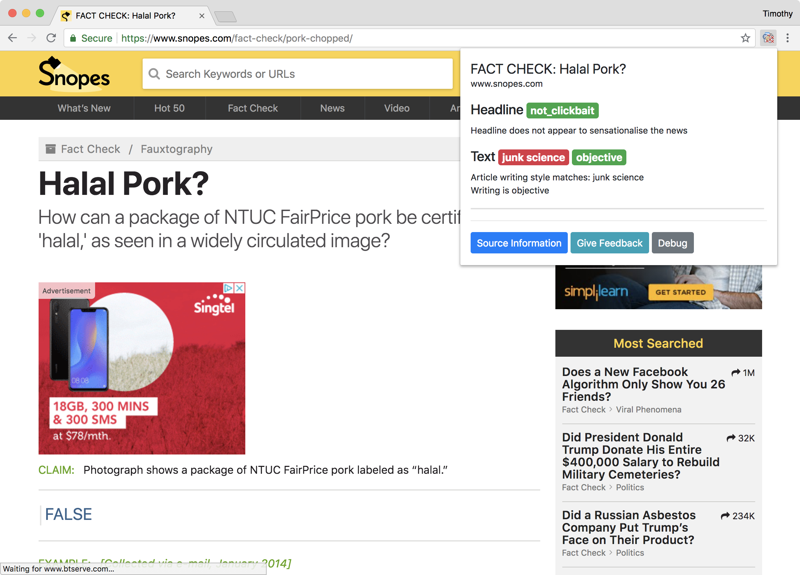

# Fake News Chrome Extension
Chrome Extension to help fight Online Misinformation

## Objective

To create a tool that can assist members of the public to be more vigilant in the face of online misinformation. To that end, we are developing a Chrome extension that can:

* Evaluate the quality of an article
* Alert the user of clickbait, subjective or "toxic" content
* Suggest related fact-check ["ClaimReview" articles](https://www.datacommons.org/docs/faq.html#0)

## When it works

### Fact Checking

* Here's an article on Trump
  

* Clicking on "View Fact Check" brings you to
  

**Other examples**

* 
* 

### Article Quality

* 
* 
* 
* 

It was hard to find "toxic" content, so here is a Reddit post as an example

* 

## When it doesn't work

*  
* 

Many Singapore fact-checks, even those that are on Snopes, are **not in the DataCommons** database.

## Technology Stack

Backend Endpoint API: 

* Python 3
* Flask + Gunicorn for serving
* Keras and TensorFlow-MKL for AI/DL inference

Threading and Batching is used to speed up inference on an Intel Skylake SP running on Google Cloud Compute Engine. A typical page takes 4 seconds for inference with the 4 NLP models we currently have in place.

[GitHub repository for the backend.](https://github.com/tlkh/fake-news-web-api)

Chrome Extension:
Chrome Extension API, Bootstrap 4, JavaScript